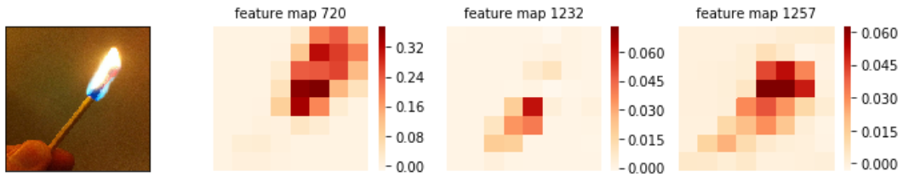
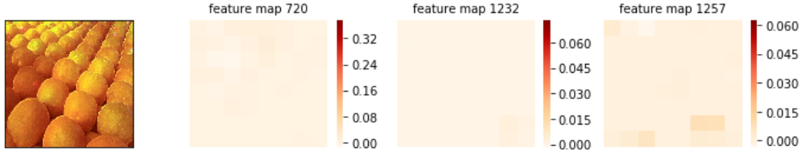

# Leveraging Model Interpretability and Stability to increase Model Robustness

This is the backbone code of the paper [Leveraging Model Interpretability and Stability to increase Model Robustness](https://arxiv.org/abs/1910.00387).
## Objective
- The purpose of this work is to detect potential prediction errors of a CNN and cancel those predictions.
- Inputs whose prediction are cancelled are not further processed by the CNN. Depending on the application, those inputs can be processed by a human.
## How to detect wrong prediction

- Above images of a matchstick and oranges are both predicted as a matchstick object by a CNN (InceptionV3) that correctly predicted the matchstick image but made an error on the orange image.
- Through a serie of experiments, the 720th, 1232th and 1257th feature maps from layer mixed8 of the InceptionV3 network are identified as feature maps that react strongly when a matchstick image is given to the CNN. They are defined as feature maps specific to the class of matchstick.
- We can observe that the prediction as matchstick of the orange image doesn't trigger those feature maps whereas the prediction of the matchstick image does. Thus, we can differentiate a wrong prediction and a correct prediction by visualizing the feature maps of the corresponding predicted class (matchstick here).
- Conductance is the name of the metric computed on these feature maps (not activations) and they are used to measure the reaction strength of these feature maps. See the [work](https://arxiv.org/abs/1805.12233) of Dhamdhere et al. for further details.
- Each neuron (square) has a conductance value and the conductance of a feature map is the sum of its neuron's conductance.
## How to automate the distinction process of wrong and correct predictions
- Given an image dataset, we calculate the conductance of all images on a selected number of feature maps. Two examples are shown below with conductance (of all feature maps from layer mixed8) obtained on the previous two images. Once again, we can distinguish the wrong and the correct predictions by looking at their pattern of conductance.

- The conductance data is then just some structured data, with the number of row being the number of image and the number of column being the number of feature map.
- We divide the conductance data into training, validation and test to train and evaluate a binary classifier that will learn to differentiate conductance of wrong and correct predictions.
- Additionally, we can include the Label Change Rate (LCR) of these images to have better classification results. LCR is another metric that can differentiate wrong and correct prediction of CNNs. See the [work](https://arxiv.org/abs/1812.05793) of Wang et al. for further details.
## Imagenet file how to use
- Use 'training_conductance.py' and 'val_test_conductance.py' to calculate the conductance on image training, validation and test sets.
- To incorporate LCR, first use build_mutations.py to create modified version of the CNN.
- Then use 'mutant_prediction.py' to calculate the LCR of desired image set.
- After computing conductance (with or not LCR) please follow code in '100_class_imagenet.ipynb' (or 50) notebook to see how the binary classifier is trained and evaluated.

## cifar10 file how to use
- For now please ignore the scripts folder and use the 'conductance&mutation.ipynb' notebook to calculate conductance and LCR

## work in progress to make the repository's code easier to read
